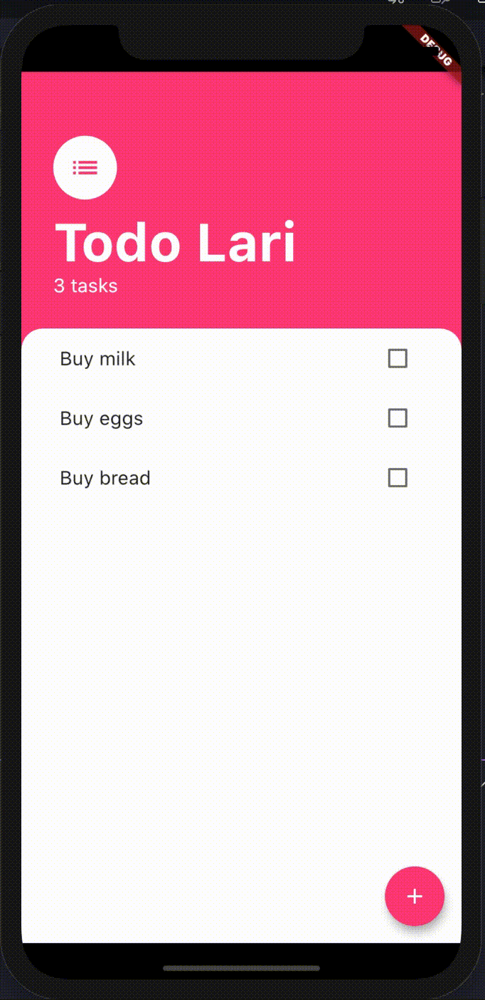

# Todo app

This is an app to practice flutter and manage your tasks.

# How to run

```shell
cd todo_app/
flutter run
```

Or do Fn + F5 if you're on mac notebook

# Final Result

You can see when you click the app, that will manage your tasks. Image of the app:

View of the app



## Technologies

- Flutter

# Made By

- [Linkedin](https://br.linkedin.com/in/larissa-varj%C3%A3o-152932b8)
- [Website](http://larissavarjao.com/)
